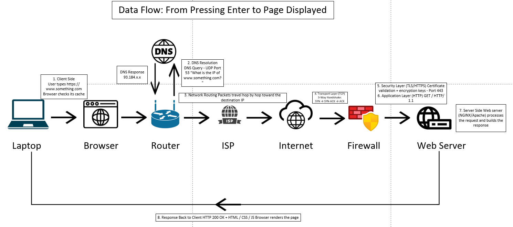
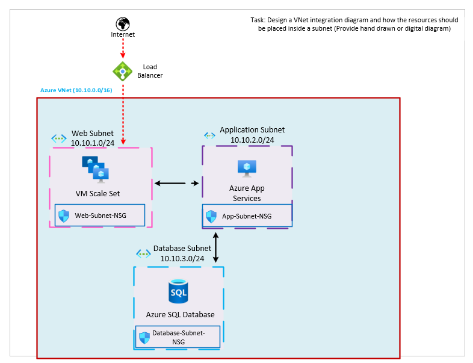

# Networking Assignment 2

## 1. Basic commands and protocols

### ipconfig

`ipconfig` shows the network settings of a Windows computer, such as its IP address, subnet mask, default gateway, and DNS server.


### nslookup

`nslookup` checks DNS. It finds the IP address belonging to a domain name.

```text
nslookup www.google.com
```

This asks the DNS server for the IP address of Google.


### ping

`ping` checks whether another computer or server can be reached. It also shows the response time.

```text
ping www.google.com
```

It sends a small request and waits for a reply. A blocked firewall can cause ping to fail even when the website works.


### traceroute

`traceroute` shows the routers, or hops, used to reach a destination. On Windows the command is called `tracert`.

```text
tracert www.google.com
```

This is useful for finding where a connection is slow or stops.


### TCP and UDP

TCP and UDP are transport protocols. They use port numbers to send data to the correct application.

| TCP | UDP |
| --- | --- |
| Creates a connection first | Does not create a connection first |
| Checks delivery and order | Does not guarantee delivery or order |
| Used by HTTPS, SSH, and email | Used by DNS, video calls, and streaming |
| More reliable but slower | Faster with less overhead |


## 2. What happens after entering `https://www.something.com`?

### Data flow



1. **The browser reads the URL.** It understands that `https` means a secure web connection, the website name is `www.something.com`, and the default port is `443`.

2. **DNS resolves the domain name.** The browser first checks its local cache, then asks a DNS server for the IP address of the website. This converts the domain name into an IP address.

3. **The packet leaves the client.** The request is sent from the computer to its default gateway, usually a home or office router. The device may use NAT so that a private internal IP can communicate with the public internet.

4. **The request is forwarded across the network.** Routers pass the packet hop by hop through the ISP and the internet until it reaches the destination server.

5. **TCP establishes a connection.** The client and server use a three-way handshake: `SYN`, `SYN-ACK`, and `ACK`. This ensures that the connection is opened correctly before data is sent.

6. **TLS secures the connection.** The server presents a certificate, and the browser verifies that it is valid and trusted. Then both sides agree on encryption keys for secure communication.

7. **The browser sends the HTTPS request.** The request is encrypted and asks the server for the home page, for example:

   ```http
   GET / HTTP/1.1
   Host: www.something.com
   ```

8. **The server processes the request.** The web server finds or generates the page and sends back a response. The response usually contains HTML, CSS, JavaScript, and other assets.

9. **The browser displays the page.** The response is decrypted, parsed, and rendered. The browser downloads additional files, builds the page layout, and displays it on the screen.

## 3. Azure VNet design

The diagram below shows an Azure Virtual Network with multiple subnets and security controls.



In this architecture:

- The user connects to the internet through a public entry point.
- A load balancer distributes traffic into the Azure VNet.
- The Azure VNet contains separate subnets for web, application, and database resources.
- The web subnet hosts the VM scale set and is controlled by a subnet NSG.
- The application subnet hosts Azure App Services and has its own NSG.
- The database subnet hosts the Azure SQL database and is protected by a database subnet NSG.
- Internal traffic is restricted by NSGs, which act as firewalls for subnet-level filtering.

This design improves security, segmentation, and scalability by separating services into different network areas.
